# 👋 I'm Tema — aka TrothByte

### *I measured the earth. Now I'm building the digital world — and dreaming bigger than both.*

 

 

> [!IMPORTANT]
> A dream is not a destination. It's a direction — and I'm walking in mine with everything I've got.

---

<b>🇬🇧 English — about me</b>

### 🚀 The Dreamer Behind the Screen

I used to measure the earth — land, coordinates, plans, numbers. Now I'm mapping a different world: bytes, memory, machines, and the intelligence learning to speak their language.

Some people look at a bug and see a problem. I look at it and see a promise — a small door the world left open, waiting for someone to walk through. I intend to walk through.

- 🌱 From **land surveying** to **software** — a path built one failed build at a time.
- 🤖 I believe **AI is the new basic skill** — as fundamental as search was ten years ago. So I learn it, practice it, and build with it.
- 🔥 I write in **Python**, **C++**, and I'm diving deep into **low-level engineering** — compilers, memory, and the things that make machines honest.
- 🛠️ I'm building **[TrothByte](https://github.com/TrothByte/low-level-skills-trothbyte)** — a library that teaches AI agents to write code that isn't just correct, but *safe and verified*.
- 💪 I don't promise perfect code. I promise effort, honesty, and that every step makes the world a little better.

### 🗺️ What You'll Find Here

My projects — learning experiments, small adventures, and things I hope become useful to others. Every repository is a step forward, and I'm proud of every single one.

### 📬 Let's Talk

- **Email:** [temacom159@gmail.com](mailto:temacom159@gmail.com)

<b>🇷🇺 Русский — обо мне</b>

### 🚀 Мечтатель за экраном

Когда-то я измерял землю — участки, координаты, планы, цифры. Сегодня я осваиваю другой мир: байты, память, машины и разум, который учится говорить на их языке.

Кто-то смотрит на баг и видит проблему. Я смотрю и вижу обещание — маленькую дверь, которую мир оставил приоткрытой, ожидая того, кто рискнёт войти. Я собираюсь войти.

- 🌱 Путь от **кадастра** до **программирования** — пройденный через ошибки и упорство.
- 🤖 Я убеждён: **ИИ — новый базовый навык**, такой же, каким был поиск в Google десять лет назад. Поэтому я учусь, практикуюсь и создаю с его помощью.
- 🔥 Пишу на **Python**, **C++** и погружаюсь в **низкоуровневую инженерию** — компиляторы, память и всё, что делает машины честными.
- 🛠️ Я строю **[TrothByte](https://github.com/TrothByte/low-level-skills-trothbyte)** — библиотеку навыков, которая учит ИИ-агентов писать код, который не просто компилируется, а *безопасен и проверен*.
- 💪 Я не обещаю идеального кода. Я обещаю усилия, честность и то, что каждый шаг делает мир чуть лучше.

### 🗺️ Что вы здесь найдёте

Мои проекты — учебные эксперименты, маленькие приключения и то, что, надеюсь, пригодится другим. Каждый репозиторий — шаг вперёд, и я горжусь каждым из них.

### 📬 Связаться со мной

- **Почта:** [temacom159@gmail.com](mailto:temacom159@gmail.com)

---

Latest writing on [dev.to](https://dev.to/trothbyte) · main project: [Low-level skills TrothByte](https://github.com/TrothByte/low-level-skills-trothbyte)

 

*Made with 💛, stubborn curiosity, and an unshakable belief that the world can be better.*

